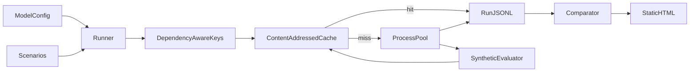

# Architecture

Evalflow is a synthetic prototype. It is not a Nuro system and not a real autonomy stack.



## Contracts

`Scenario` has an id, a category (`night`, `rain`, `unprotected_left`, `highway_merge`, `construction`), a seed, and `depends_on`. `depends_on` is a subset of `perception`, `planner`, and `prediction`, stored in that order.

`ModelConfig` has a version and a parameter mapping for each of those three components.

`Metrics` is synthetic: `passed`, `min_distance_m` (higher is better), and `jerk` (lower is better).

A run file is JSONL. The first line is a header (`wall_clock_s`, `hits`, `misses`, `workers`, `cache_enabled`, model version, evaluator version). Each following line is a scenario record: id, category, cache status (`hit` or `miss`), cache key, metrics, `duration_s`, and an optional error.

## Cache key

```
sha256(evaluator_version + scenario_fingerprint + hashes of depends_on components only)
```

The scenario fingerprint and each component hash are sha256 of canonical JSON (`sort_keys`, compact separators). Components outside `depends_on` are not part of the key. The evaluator version constant lives in `evaluator.py` (`synthetic-v1`). Bumping it invalidates every entry.

Payloads are stored at `.cache/evalflow/{key[:2]}/{key}.json` (the CLI `--cache-dir` is that directory). Writes use a temp file in the destination directory and `os.replace`.

A missing entry is a miss. The runner logs one warning with the missing count and recomputes. An entry that exists but is unreadable or fails the metrics schema is also a miss: that key logs a warning, the scenario is recomputed, and the payload is overwritten. The run continues.

Hits load the stored metrics and record `duration_s` of 0. Misses go through `ProcessPoolExecutor`. The worker is a module-level function so it pickles. It receives only the `depends_on` parameters, writes the cache entry, and returns a record. An exception becomes a record with `error` set. Other scenarios still finish. The CLI exits non-zero if any scenario errored.

`wall_clock_s` is end to end for the run, including cache lookups.

## Evaluator

`evaluate` sleeps for `cost_s`, then returns a deterministic function of the scenario id, category, seed, and the parameters it was given. It rejects a component set other than `depends_on`, so an unrelated edit cannot change outputs without changing the key. The default CLI cost is `0.1` seconds. Tests pass `0`.

v1's planner is conservative. v2 lowers `planner.conservatism` only. Planner-dependent metrics move distance down and jerk up. The unprotected-left term is what flips a few of those cases from pass to fail when conservatism drops below `0.7`. Other categories stay passing.

## Comparator and report

Rows join on scenario id.

- Pass true to false: regression. False to true: improvement.
- `min_distance_m` worsens if the candidate is below the baseline by more than `0.05`.
- `jerk` worsens if the candidate is above the baseline by more than `0.10`.
- Inside both tolerances, with no pass flip: unchanged.
- A scenario that both improves and regresses counts as a regression.

Category counts come from a pandas `value_counts` on category and status. Top regressions sort pass flips first, then by largest normalized worsen:

```
max(0, (baseline.min_distance_m - candidate.min_distance_m) / distance_tol)
+ max(0, (candidate.jerk - baseline.jerk) / jerk_tol)
```

`report.py` renders `templates/report.html.j2` to one HTML file: a summary banner, an inline SVG of the three counts, a category table, the top regressions, a runtime block (wall clock, hits, and misses from both headers), and a synthetic disclaimer in the footer. There is no Plotly.

## Out of scope

Ray, Parquet, bootstrap confidence intervals, and `--watch`.
